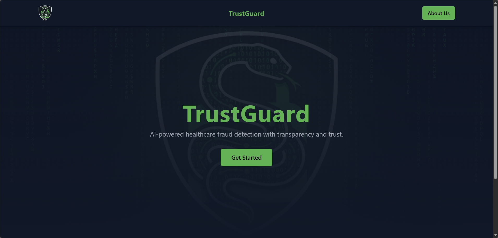
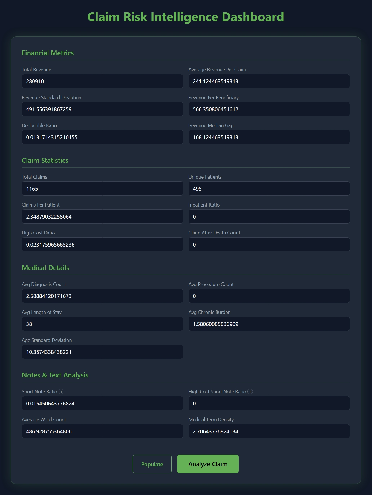
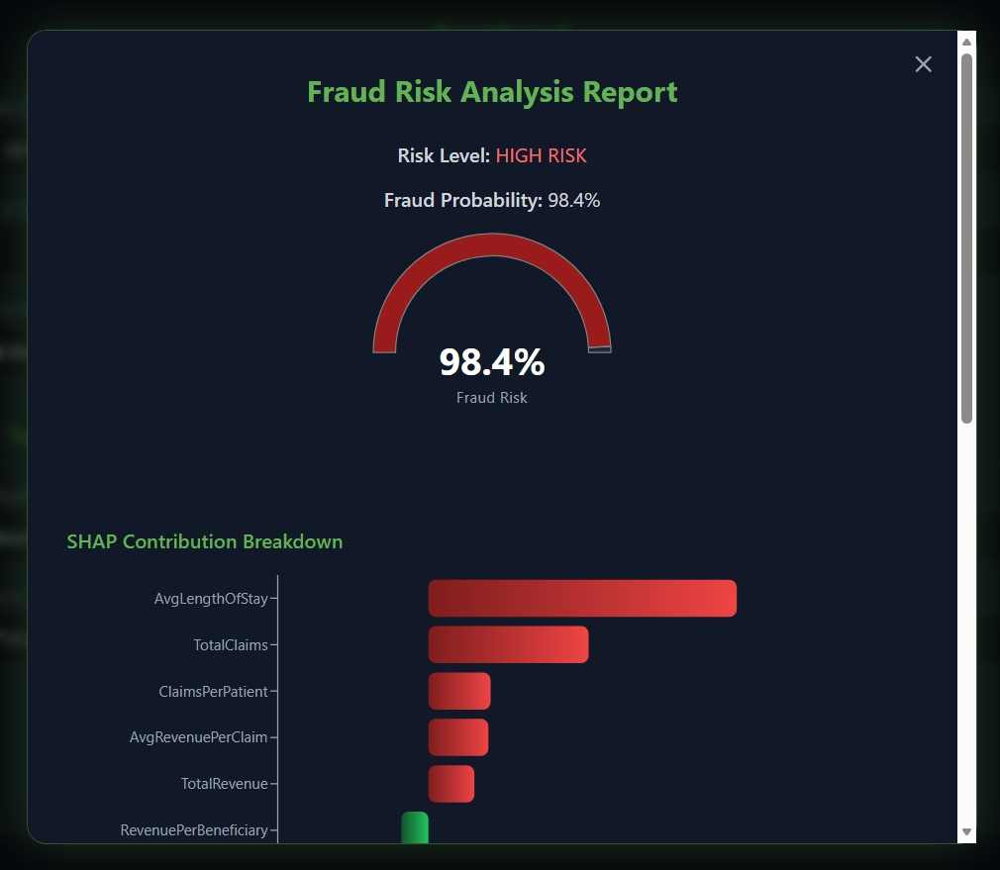
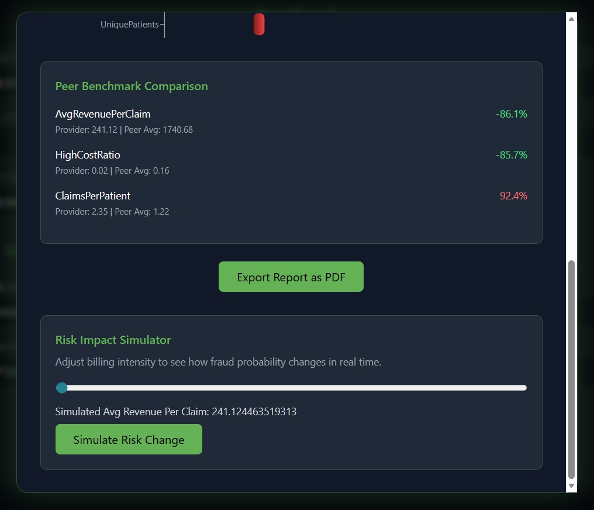

# 🛡️ TrustGuard — AI-Powered Fraud Detection System


---

## 📌 Overview

**TrustGuard** is an AI-assisted healthcare claims intelligence platform that analyzes structured billing data and clinical-text metrics to detect potential fraud and anomalies.

It combines:

- Rule-based screening
- Machine Learning prediction
- SHAP explainability
- Interactive simulations

to deliver **transparent and ethical risk assessment**.

> ⚠️ This system is strictly advisory and does not make legal or enforcement decisions.

---

## 🚀 Key Features

### ✅ Intelligent Risk Assessment

- Logistic Regression ML model
- Deterministic rule engine
- Probability-based fraud scoring

### ✅ Explainable AI

- SHAP waterfall visualization
- Feature contribution breakdown
- Transparent reasoning

### ✅ Interactive Dashboard

- Real-time analysis
- Risk gauge visualization
- What-if simulation
- Peer benchmarking

### ✅ Professional UI/UX

- Dark mode interface
- ECG + Matrix animations
- Animated buttons
- Responsive layout

### ✅ Exportable Reports

- PDF generation
- Downloadable AI reports

---

## 🏗️ Tech Stack

### Frontend

- ⚛️ React (Vite)
- 🎨 Tailwind CSS
- 📊 Recharts
- 🧭 React Router
- 🎯 Lucide Icons

### Backend

- 🐍 Python
- ⚡ FastAPI
- 🤖 Scikit-learn
- 📈 SHAP
- 🗃️ Joblib

### Machine Learning

- Logistic Regression Pipeline
- StandardScaler + Imputer
- Synthetic/Public Datasets

---

## 📁 Project Structure

```
TrustGuard/
│
├── frontend/
│   ├── src/
│   │   ├── components/
│   │   ├── pages/
│   │   ├── assets/
│   │   └── App.jsx
│   └── package.json
│
├── backend/
│   ├── main.py
│   ├── utils/
│   │   └── rule_engine.py
│   └── requirements.txt
│
├── ml/
│   └── notebooks/
│       └── trustguard.pkl
│
└── README.md
```

---

## ⚙️ Installation & Setup

### 1️⃣ Clone Repository

```bash
git clone <repository-url>
cd TrustGuard
```

---

### 2️⃣ Frontend Setup

```bash
cd frontend
npm install
npm run dev
```

Frontend runs on:

```
http://localhost:5173
```

---

### 3️⃣ Backend Setup

```bash
cd backend
pip install -r requirements.txt
```

Run API:

```bash
python -m uvicorn main:app --reload
```

Backend runs on:

```
http://127.0.0.1:8000
```

---

## 🔗 API Endpoint

### 📍 POST `/predict`

#### Request

```json
{
  "TotalRevenue": 280910,
  "AvgRevenuePerClaim": 241.12,
  "RevenueStd": 491.55,
  "RevenuePerBeneficiary": 566.35,
  "DeductibleRatio": 0.01
}
```

#### Response

```json
{
  "decision": "HIGH RISK",
  "risk_score": 0.984,
  "sorted_shap": [],
  "risk_breakdown": {},
  "top_risk_drivers": []
}
```

---

## 🧪 Demo Mode

A **Run Demo** button auto-fills realistic healthcare metrics for:

- Testing
- Presentations
- Judge walkthroughs

---

## 📊 Model Pipeline

```
Input → Rule Engine → ML Model → SHAP → Dashboard
```

Steps:

1. Rule Screening
2. Feature Scaling
3. Logistic Regression
4. SHAP Explainability
5. Risk Categorization

---

## 📈 Explainability (XAI)

TrustGuard uses **SHAP** to provide:

- Feature impact values
- Positive/Negative contributions
- Transparent reasoning

This ensures ethical and interpretable AI.

---

## 📄 Disclaimer

> ⚠️ Advisory System Only

This tool:

- ❌ Does not enforce actions
- ❌ Does not make legal decisions
- ❌ Does not replace human review

All outputs must be reviewed by domain experts.

---

## 👥 Team

- Frontend & Integration: Ansh Rastogi.
- Machine Learning: Sritiz Sahu
- Backend & Data: Ansh Rastogi

---

## 🏆 Hackathon Compliance

This project satisfies:

✔ AI-assisted analysis
✔ Explainability
✔ Ethical safeguards
✔ Public/Synthetic datasets
✔ Advisory-only design

---

## 📸 Screenshots

### Hero Page



### Analysis input page



### Analysis outputs




---

## 📜 License

This project is intended for **educational and hackathon purposes only**.

---

## 💡 Future Enhancements

- LLM-based document analysis
- OCR for medical records
- Cloud deployment
- Real-time alerts
- Multi-provider comparison
- Mobile dashboard

---

## 🙌 Acknowledgements

- FastAPI
- SHAP
- Scikit-learn
- Recharts
- Open-source community
